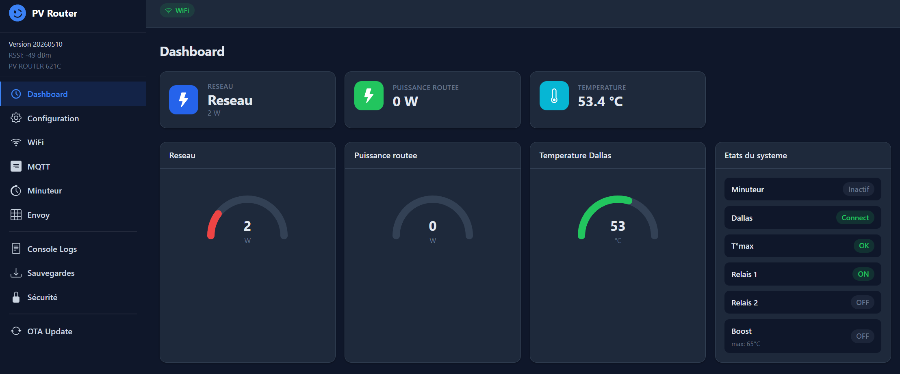
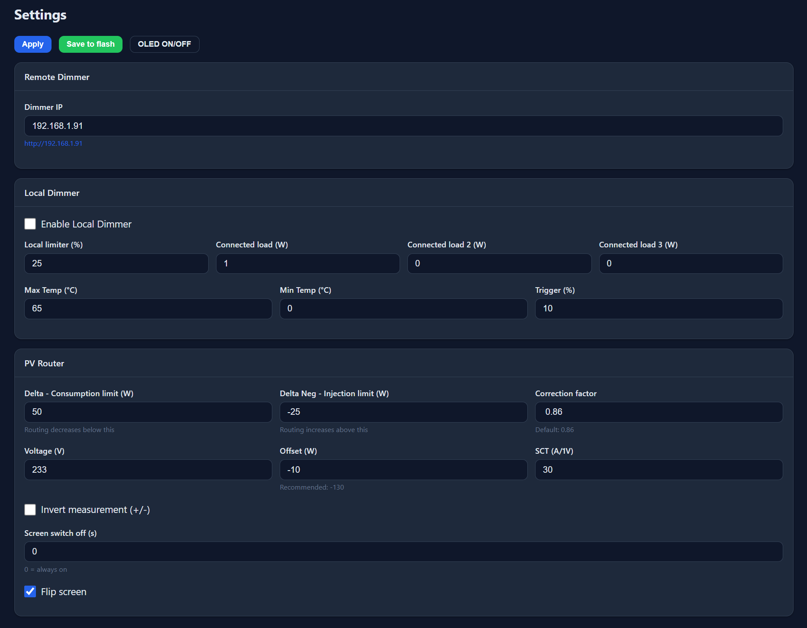

# Photovoltaic Router - ESP32 TTGO T-Display (C_Lyric Version)

[](http://creativecommons.org/licenses/by-nc-sa/4.0/)
[](https://github.com/xlyric/pv-router-esp32/stargazers)

[🇫🇷 Version Française](#français) | [🇬🇧 English Version](#english)

---

## Français <a name="français"></a>

### 🌞 Vue d'ensemble

Ce projet est le **routeur principal** d'un système de routage photovoltaïque intelligent. Il mesure en temps réel les échanges d'énergie au niveau du compteur électrique (via une sonde SCT013 ou famille Shelly ) et pilote des [variateurs AC distants](https://github.com/xlyric/PV-discharge-Dimmer-AC-Dimmer-KIT-Robotdyn) ou directement sur la carte pour maximiser l'autoconsommation solaire.

Le routeur tourne sur un **TTGO T-Display** (ESP32 avec écran couleur intégré) et offre une interface web complète pour le suivi et la configuration.
( ou un Wemos ESP32 sur la carte dimmer avec un Shelly pour la mesure )


> 📚 La documentation complète est disponible sur le [wiki APPER (en français)](https://wiki.apper-solaire.org/)

Il s'agit du routeur PV opensource de l'association française [APPER](https://www.apper-solaire.org/). La carte est open source, mais vous pouvez la commander directement auprès de l'association. Celle-ci étant reconnue d'intérêt général au regard de la fiscalité française, elle génère un **crédit d'impôt de 60%** pour les particuliers français.

Tout le travail de développement des cartes et du logiciel est purement bénévole. Un petit encouragement fait toujours plaisir :

[](https://ko-fi.com/V7V3MURX2)

**La carte au format DIN** est [disponible à la commande sur Helloassos](https://www.helloasso.com/associations/apper/formulaires/6) (le TTGO et les éléments externes ne sont pas fourni ), livrée avec son support DIN. Frais de port inclus pour les pays européens.

[](https://pvrouteur.apper-solaire.org/uploads/images/gallery/2023-06/image-1685646688128.jpg)

---

### ✨ Caractéristiques principales

- 📊 Mesure en temps réel du flux d'énergie (injection / soutirage réseau)
- 🎛️ Pilotage de [variateurs AC distants](https://github.com/xlyric/PV-discharge-Dimmer-AC-Dimmer-KIT-Robotdyn) ou locaux (Robotdyn / SSR)
- 🖥️ Écran couleur intégré (TTGO T-Display) avec indicateurs WiFi
- 🌐 Interface web complète et responsive (dashboard + configuration)
- 🔗 Intégration MQTT, Home Assistant, Jeedom, Domoticz
- 📡 Source d'énergie externe compatible (Shelly EM, Enphase Envoy)
- 🌡️ Surveillance de la température avec sondes Dallas 18B20
- ⏱️ Planificateur horaire (minuteur par charge)
- 🔒 Mécanismes de sécurité intégrés (fusible, sonde température recommandée)
- 🔄 Mise à jour OTA intégrée

---

### 🔌 Principe de fonctionnement

```
Panneaux solaires
      │
      ▼
[Onduleur] ──────► Réseau électrique
      │
      ▼
[Compteur Linky] ──[Sonde SCT013 ou Shelly]──► [Routeur PV - TTGO T-Display]
                                                       │
                                          ┌────────────┴────────────┐
                                          ▼                         ▼
                                [Variateur distant]         [Relais locaux]
                        (PV-Dimmer ESP8266/ESP32)     (Ballon ECS, chauffage…)
```

Le routeur analyse la direction du courant au compteur :
- **Injection (négatif)** → surplus solaire → augmentation progressive de la charge
- **Soutirage (positif)** → consommation réseau → réduction de la charge

L'objectif : maintenir un échange réseau proche de **0 W** en permanence pour maximiser l'autoconsommation.

---

### 🚀 Installation

#### ⚠️ Rappel de sécurité

> Avant de raccorder la carte au réseau électrique, respectez les normes électriques locales :
> - Utilisez des câbles correctement isolés pour éviter les courts-circuits.
> - Installez des protections (disjoncteur 2A minimum).
> - En cas de doute, faites appel à un professionnel qualifié.
> - Utilisez toujours des sondes Dallas pour surveiller les températures.

#### Méthode 1 : Web OTA (recommandée)

Depuis un navigateur compatible (Chrome ou Edge) :

1. Rendez-vous sur [https://ota.apper-solaire.org/ota.php](https://ota.apper-solaire.org/ota.php)
2. Sélectionnez le port série auquel le TTGO est connecté
3. Choisissez **"INSTALL PV ROUTER TTGO"** ou une autre version selon votre carte
4. Validez le message d'installation — le programme est chargé automatiquement

[](https://pvrouteur.apper-solaire.org/uploads/images/gallery/2022-10/image-1665674872288.png)

#### 🔄 Mises à jour

- Versions officielles disponibles sur : [GitHub Releases](https://github.com/xlyric/pv-router-esp32/releases)
- Mise à jour OTA directement depuis la page `/update` de l'interface web du routeur

---

### 📡 Configuration WiFi

#### Par port série

Après le flash, ouvrez la console série ("Log & Console") et saisissez :

```
pass votre_mot_de_passe_wifi
ssid votre_ssid_wifi
reboot
```

L'écran TTGO affiche l'IP et le niveau de signal WiFi (en haut à droite) :
- 🟡 Jaune : > -64 dBm (bon)
- 🟠 Orange : > -70 dBm (moyen)
- 🔴 Rouge : > -80 dBm (faible)

#### Par mode AP

Connectez-vous au point d'accès WiFi du routeur et configurez votre réseau via l'interface captive.

---

### 🖥️ Interface Web

Connectez-vous à l'IP affichée sur l'écran TTGO depuis votre navigateur.

#### Dashboard

[](img/index.png)

Vous y trouvez :
- **Sigma (W)** : puissance échangée avec le réseau
- **Dimmers (%)** : puissance envoyée aux variateurs
- **Température (°C)** : sonde du 1er variateur ou sonde locale
- **État** : Stable / Injection / Réseau
- **Bouton ON/OFF OLED** : commande de l'écran (timer configurable)

#### Page de configuration

Accessible via le menu "Configuration" 

[](img/setup.png)

---

### 🔌 Raccordement électrique

#### Schéma de câblage

*(Schéma réalisé par Titi)*

[](https://pvrouteur.apper-solaire.org/uploads/images/gallery/2023-09/image-1695292302393.png)

La carte dispose d'une protection intégrée (fusible verre 0,15A ou automatique), mais il est recommandé de la placer derrière un disjoncteur 2A.

#### Installation sans variateur distant

Installez la carte dans le tableau électrique et connectez la sonde SCT013 sur la **phase de sortie du compteur Linky** (entre le Linky et le tableau).

#### Installation avec variateur distant

En plus de la sonde SCT013, connectez le [variateur Dimmer](https://github.com/xlyric/PV-discharge-Dimmer-AC-Dimmer-KIT-Robotdyn) à l'emplacement prévu sur la carte. Une sonde Dallas 18B20 est fortement recommandée pour éviter toute surchauffe.

> Il est conseillé d'alimenter le Robotdyn en aval des résistances du ballon pour une double sécurité thermique.

#### Recommandations

- Sur les ballons en stéatite : n'utilisez qu'une seule résistance pour une régulation plus fine et moins de perturbations réseau.
- Prenez le plus grand variateur Robotdyn (20A) ou un SSR Random 40A minimum.
- En cas de puissance élevée, ventilez le dissipateur thermique du variateur (triac).

---

### 🎛️ API Web

#### État et surveillance

| Endpoint | Méthode | Description |
|----------|---------|-------------|
| `/state` | GET | État courant (JSON) |
| `/stateshort` | GET | État abrégé (JSON) |
| `/statefull` | GET | État complet (JSON) |
| `/config` | GET | Configuration (JSON) |
| `/ping` | GET | Test de connectivité |

#### Contrôle système

| Endpoint | Description |
|----------|-------------|
| `/reboot` | Redémarrage |
| `/boost` | Mode boost 2h |
| `/resetdallas` | Réinitialisation sonde Dallas |

#### Configuration (`/get`)

| Paramètre | Description |
|-----------|-------------|
| `?cycle=X` | Cycle de mesure |
| `?delta=X` | Seuil puissance positive |
| `?deltaneg=X` | Seuil puissance négative |
| `?tmax=X` | Température maximale |
| `?voltage=X` | Tension réseau |
| `?cosphi=X` | Facteur de puissance |
| `?offset=X` | Offset de mesure |
| `?ssid=X` | SSID WiFi |
| `?pass=X` | Mot de passe WiFi |
| `?save=1` | Sauvegarde en flash |

#### Relais

- `?relay1=0/1/2` : OFF / ON / Toggle relais 1
- `?relay2=0/1/2` : OFF / ON / Toggle relais 2

#### Minuteurs

- `GET /getminuteur?dimmer` : Lecture minuteur variateur
- `ANY /setminuteur` : Réglage (`heure_demarrage`, `heure_arret`, `temperature`, `puissance`)

#### Intégrations

| Endpoint | Description |
|----------|-------------|
| `/getwifi` | Configuration WiFi |
| `/getenvoy` | Données Enphase Envoy |
| `/getmqtt` | Configuration MQTT (JSON) |
| `/log.txt` | Journal système |
| `/getmemory` | Utilisation mémoire (JSON) |
| `/cosphi` | Mesure du facteur de puissance |

---

### 🛠️ Dépannage

#### Problèmes courants

- ❌ **Pas de connexion WiFi**
  - Vérifiez les identifiants réseau
  - Redémarrez l'appareil
  - Vérifiez le niveau de signal sur l'écran TTGO

- 🔌 **Mesure de puissance incorrecte**
  - Vérifiez le positionnement de la sonde SCT013 (phase sortie compteur Linky)
  - Ajustez les paramètres `cosphi` et `offset` via l'API

- 🌡️ **Sonde de température non détectée**
  - Vérifiez le câblage Dallas 18B20
  - Utilisez `/resetdallas` pour forcer une réinitialisation

#### Outils de diagnostic

- Journal système : `/log.txt`
- Console série : depuis l'outil OTA → "Log & Console"
- État complet : `/statefull`
- Mémoire des tâches : `/getmemory`

---

### 🤝 Contribution

1. Forkez le projet
2. Créez une branche (`git checkout -b feature/MaFonctionnalite`)
3. Commitez vos modifications (`git commit -m 'Ajout MaFonctionnalite'`)
4. Poussez la branche (`git push origin feature/MaFonctionnalite`)
5. Ouvrez une Pull Request

---

### 📦 Dépendances

- PlatformIO
- ESP32 Arduino Core
- ArduinoJson
- OneWire
- DallasTemperature
- TFT_eSPI (affichage TTGO T-Display)

---

### 🛒 Achat du matériel

#### Kit recommandé

- **Carte routeur DIN** : vendue par l'[association APPER](https://www.helloasso.com/associations/apper/formulaires/6)
  - Crédit d'impôt **60%** en France
  - Frais de port inclus (Europe)
  - Support DIN fourni

- **Composants additionnels** :
  - TTGO T-Display (ESP32 avec écran couleur intégré)
  - Sonde SCT013 (mesure de courant)
  - Sonde Dallas 18B20 (température)

- **Variateur (optionnel)** : voir le projet complémentaire [PV-Dimmer](https://github.com/xlyric/PV-discharge-Dimmer-AC-Dimmer-KIT-Robotdyn)

| Composant | Prix approx. |
|-----------|-------------|
| Carte APPER | 25€ |
| TTGO T-Display | 12€ |
| Sonde SCT013 | 8€ |
| **Total** | **~45€** |

---

### 🏆 Crédits

- Développé bénévolement par [Sunstain Tech Solutions](https://sunstain.fr) pour la communauté [APPER](https://www.apper-solaire.org/)
- Schéma de câblage réalisé par Titi
- Contributions de la communauté open-source
- Projet open-source à usage non commercial

---

### 📄 Licence

Ce projet est sous licence [Creative Commons Attribution-NonCommercial-ShareAlike 4.0 International](http://creativecommons.org/licenses/by-nc-sa/4.0/)

[](http://creativecommons.org/licenses/by-nc-sa/4.0/)

---

## English <a name="english"></a>

### 🌞 Overview

This project is the **main router** of an intelligent photovoltaic routing system. It measures real-time energy exchanges at the electricity meter (via an SCT013 sensor or Shelly family device) and controls [remote AC dimmers](https://github.com/xlyric/PV-discharge-Dimmer-AC-Dimmer-KIT-Robotdyn) or local dimmers to maximize solar self-consumption.

The router runs on a **TTGO T-Display** (ESP32 with built-in color display) and provides a complete web interface for monitoring and configuration.
(or a Wemos ESP32 on the dimmer board with a Shelly for power measurement)

> 📚 Full documentation available on the [APPER wiki (French)](https://wiki.apper-solaire.org/)

This is the open-source PV router from the French association [APPER](https://www.apper-solaire.org/). The board is open-source, but you can order it directly from the association. As a recognized public-interest organization under French tax law, purchases generate a **60% tax credit** for French individuals.

All development work is purely voluntary. Encouragements are always welcome:

[](https://ko-fi.com/V7V3MURX2)

**The DIN format board** is [available to order on Helloassos](https://www.helloasso.com/associations/apper/formulaires/6) (TTGO not included) — shipped with DIN rail mount. Shipping included for European countries.

[](https://pvrouteur.apper-solaire.org/uploads/images/gallery/2023-06/image-1685646688128.jpg)

---

### ✨ Key Features

- 📊 Real-time energy flow measurement (injection / grid draw)
- 🎛️ Control of [remote AC dimmers](https://github.com/xlyric/PV-discharge-Dimmer-AC-Dimmer-KIT-Robotdyn) or local dimmers (Robotdyn / SSR)
- 🖥️ Built-in color display (TTGO T-Display) with WiFi signal indicators
- 🌐 Comprehensive and responsive web interface (dashboard + configuration)
- 🔗 MQTT, Home Assistant, Jeedom, Domoticz integration
- 📡 External energy source support (Shelly EM, Enphase Envoy)
- 🌡️ Temperature monitoring with Dallas 18B20 sensors
- ⏱️ Time-based scheduler (timer per load)
- 🔒 Integrated safety mechanisms (fuse, recommended temperature sensor)
- 🔄 Built-in OTA updates

---

### 🔌 Operating Principle

```
Solar panels
      │
      ▼
[Inverter] ──────► Electrical grid
      │
      ▼
[Linky meter] ──[SCT013 sensor or Shelly]──► [PV Router - TTGO T-Display]
                                                      │
                                         ┌────────────┴────────────┐
                                         ▼                         ▼
                               [Remote dimmer]             [Local relays]
                       (PV-Dimmer ESP8266/ESP32)     (Water heater, heating…)
```

The router analyzes the current direction at the electricity meter:
- **Injection (negative)** → solar surplus → gradually increases the load
- **Grid draw (positive)** → grid consumption → reduces the load

The goal: keep the grid exchange close to **0 W** at all times to maximize self-consumption.

---

### 🚀 Installation

#### ⚠️ Safety Reminder

> Before connecting the board to the electrical grid, comply with local electrical safety standards:
> - Use properly insulated cables to avoid short circuits.
> - Install protective devices (minimum 2A circuit breaker).
> - If unsure, consult a qualified professional.
> - Always use Dallas sensors to monitor temperatures.

#### Method 1: Web OTA (Recommended)

From a compatible browser (Chrome or Edge):

1. Go to [https://ota.apper-solaire.org/ota.php](https://ota.apper-solaire.org/ota.php)
2. Select the serial port connected to the TTGO
3. Choose **"INSTALL PV ROUTER TTGO"** or another version depending on your board
4. Confirm the installation — firmware is uploaded automatically

[](https://pvrouteur.apper-solaire.org/uploads/images/gallery/2022-10/image-1665674872288.png)

#### 🔄 Updates

- Official releases: [GitHub Releases](https://github.com/xlyric/pv-router-esp32/releases)
- OTA update directly from the router's `/update` web page

---

### 📡 WiFi Configuration

#### Via Serial Port

After flashing, open the serial console ("Log & Console") and type:

```
pass your_wifi_password
ssid your_wifi_ssid
reboot
```

The TTGO display shows the IP and WiFi signal strength (top right):
- 🟡 Yellow: > -64 dBm (good)
- 🟠 Orange: > -70 dBm (fair)
- 🔴 Red: > -80 dBm (weak)

#### Via AP Mode

Connect to the router's WiFi access point and configure your network through the captive portal interface.

---

### 🖥️ Web Interface

Connect to the IP shown on the TTGO display from your browser.

#### Dashboard

[](img/index.png)

The dashboard shows:
- **Sigma (W)**: power exchanged with the grid
- **Dimmers (%)**: power sent to dimmers
- **Temperature (°C)**: first dimmer sensor or local sensor
- **State**: Stable / Injection / Grid
- **ON/OFF OLED button**: screen control (configurable timer)

#### Configuration Page

Accessible via the "Configuration" menu.

[](img/setup.png)

---

### 🔌 Electrical Wiring

#### Wiring Diagram

*(Diagram by Titi)*

[](https://pvrouteur.apper-solaire.org/uploads/images/gallery/2023-09/image-1695292302393.png)

The board has built-in protection (0.15A glass fuse or automatic), but it is recommended to place it behind a 2A circuit breaker.

#### Simple Installation (no remote dimmer)

Install the board in the electrical panel and connect the SCT013 sensor on the **output phase of the Linky meter** (between Linky and the panel).

#### Installation with Remote Dimmer

In addition to the SCT013 sensor, connect the [Dimmer board](https://github.com/xlyric/PV-discharge-Dimmer-AC-Dimmer-KIT-Robotdyn) to the dedicated connector on the router board. A Dallas 18B20 sensor is strongly recommended to prevent overheating.

> It is advisable to power the Robotdyn dimmer downstream of the water heater heating elements for double thermal safety.

#### Recommendations

- On soapstone tanks: use only one heating element for finer regulation and fewer grid disturbances.
- Use the largest Robotdyn dimmer (20A) or a minimum 40A Random SSR.
- For high power loads, add cooling to the dimmer's heat sink (triac).

---

### 🎛️ Web API

#### Status & Monitoring

| Endpoint | Method | Description |
|----------|--------|-------------|
| `/state` | GET | Current state (JSON) |
| `/stateshort` | GET | Abbreviated state (JSON) |
| `/statefull` | GET | Full state (JSON) |
| `/config` | GET | Configuration (JSON) |
| `/ping` | GET | Connectivity test |

#### System Control

| Endpoint | Description |
|----------|-------------|
| `/reboot` | Restart device |
| `/boost` | Activate 2-hour boost mode |
| `/resetdallas` | Reset Dallas sensor detection |

#### Configuration (`/get`)

| Parameter | Description |
|-----------|-------------|
| `?cycle=X` | Measurement cycle |
| `?delta=X` | Positive power threshold |
| `?deltaneg=X` | Negative power threshold |
| `?tmax=X` | Maximum temperature |
| `?voltage=X` | Grid voltage |
| `?cosphi=X` | Power factor |
| `?offset=X` | Measurement offset |
| `?ssid=X` | WiFi SSID |
| `?pass=X` | WiFi password |
| `?save=1` | Save to flash |

#### Relays

- `?relay1=0/1/2`: OFF / ON / Toggle relay 1
- `?relay2=0/1/2`: OFF / ON / Toggle relay 2

#### Timers

- `GET /getminuteur?dimmer`: Read dimmer timer
- `ANY /setminuteur`: Set timer (`heure_demarrage`, `heure_arret`, `temperature`, `puissance`)

#### Integrations

| Endpoint | Description |
|----------|-------------|
| `/getwifi` | WiFi configuration |
| `/getenvoy` | Enphase Envoy data |
| `/getmqtt` | MQTT configuration (JSON) |
| `/log.txt` | System log |
| `/getmemory` | Task memory usage (JSON) |
| `/cosphi` | Power factor measurement |

---

### 🛠️ Troubleshooting

#### Common Issues

- ❌ **No WiFi connection**
  - Check network credentials
  - Restart the device
  - Check signal level on the TTGO display

- 🔌 **Incorrect power measurement**
  - Check SCT013 placement on Linky output phase
  - Adjust `cosphi` and `offset` parameters via the API

- 🌡️ **Temperature sensor not detected**
  - Check Dallas 18B20 wiring
  - Use `/resetdallas` to force re-detection

#### Diagnostic Tools

- System log: `/log.txt`
- Serial console: OTA tool → "Log & Console"
- Full state: `/statefull`
- Task memory: `/getmemory`

---

### 🤝 Contributing

1. Fork the project
2. Create a feature branch (`git checkout -b feature/AmazingFeature`)
3. Commit your changes (`git commit -m 'Add AmazingFeature'`)
4. Push the branch (`git push origin feature/AmazingFeature`)
5. Open a Pull Request

---

### 📦 Dependencies

- PlatformIO
- ESP32 Arduino Core
- ArduinoJson
- OneWire
- DallasTemperature
- TFT_eSPI (TTGO T-Display)

---

### 🛒 Hardware Purchase

#### Recommended Kit

- **DIN Router Board**: sold by [APPER Association](https://www.helloasso.com/associations/apper/formulaires/6)
  - **60% tax credit** in France
  - Shipping included (Europe)
  - DIN rail mount included

- **Additional components**:
  - TTGO T-Display (ESP32 with built-in color display)
  - SCT013 sensor (current measurement)
  - Dallas 18B20 probe (temperature)

- **Dimmer (optional)**: see companion project [PV-Dimmer](https://github.com/xlyric/PV-discharge-Dimmer-AC-Dimmer-KIT-Robotdyn)

| Component | Approx. Price |
|-----------|--------------|
| APPER Board | €25 |
| TTGO T-Display | €12 |
| SCT013 sensor | €8 |
| **Total** | **~€45** |

---

### 🏆 Credits

- Voluntarily developed by [Sunstain Tech Solutions](https://sunstain.fr) for the [APPER](https://www.apper-solaire.org/) community
- Wiring diagram by Titi
- Open-source community contributions
- Non-commercial open-source project

---

### 📄 License

This project is licensed under the [Creative Commons Attribution-NonCommercial-ShareAlike 4.0 International License](http://creativecommons.org/licenses/by-nc-sa/4.0/)

[](http://creativecommons.org/licenses/by-nc-sa/4.0/)
